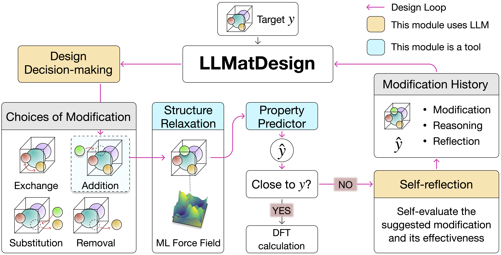

# LLMatDesign: Autonomous Materials Discovery with Large Language Models

<div align="center">

[](https://arxiv.org/abs/2406.13163)

</div>

## LLMatDesign Framework Overview
<p align="center">

</p>

## Installation
Follow the [MatDeepLearn](https://github.com/Fung-Lab/MatDeepLearn_dev) installation guide to create an environment. Then, with the environment activated, do

```
pip install -r requirements.txt
```

Git clone this repository:

```
git clone https://github.com/Fung-Lab/LLMatDesign.git
cd LLMatDesign
pip install -e .
```